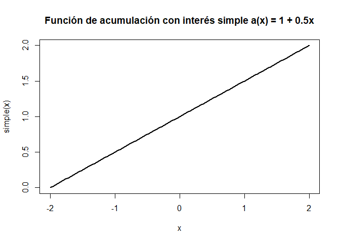

La medida del interés.
----------------------

**Definición 1** Definamos la función de acumulación *a*(*t*) como el
valor acumulado de un fondo al tiempo *t* con inversión inicial de 1
(una unidad) al tiempo 0(*a*(0) = 1).

**Definición 2** La tasa de crecimiento del *t*-ésimo año(Basado en la
cantidad del fondo al inicio del año) está dada por:
$$i\_{t} = \\frac{a(t)-a(t-1)}{a(t-1)}$$
*i*<sub>*t*</sub> también se conoce como la “tasa efectiva de interés”.

**Definición 3** Definimos la función monto *A*(*t*) como el monto
acumulado al tiempo *t* de una inversión de *k* unidades al tiempo
*t* = 0. Esto es *A*(0) = *k*.

**Obs 1** Es claro que *A*(*t*) = *k**a*(*t*), así la tasa de
crecimiento de la función monto es:
$$i\_{t} = \\frac{a(t)-a(t-1)}{a(t-1)} = \\frac{A(t)-A(t-1)}{A(t-1)}$$

**Obs 2** De lo anterior obtenemos:
*A*(*t*) = (1 + *i*<sub>*t*</sub>)*A*(*t* − 1)
Esto significa que el monto al final del *t*-ésimo año es igual al monto
al inicio del año (*A*(*t* − 1)) más un interés sobre *A*(*t* − 1).

**Ejemplo 1** Dado *A*(*t*) = *t*<sup>2</sup> + 100 cálcula *a*(10)
*A*(0) = 100 = *k**a*(0) = *k*
*A*(10) = 200 = 100*a*(10)
*a*(10) = 2

### Interés Simple.

Nos gustaría estudiar un caso particular de la función de acumulación,
nos gustaría que ver como se comporta *a*(*t*) si la ganancia acumulada
hasta al tiempo *t* es proporcional a *t*, esto es:

*a*(*t*) − *a*(0) = *i**t*
para alguna
*i* ∈ ℝ
, esto equivale a:
*a*(*t*) = 1 + *i**t*
Para toda *t* ∈ ℝ.

**Obs 3** Tenemos lo siguiente:
$$i\_{t} = \\frac{a(t)-a(t-1)}{a(t-1)} = \\frac{i}{1 + i(t-1) }$$
Para todo *t* \> 1, aquí observamos que *a*(*t*) es creciente pero
*i*<sub>*t*</sub> es decreciente.

``` r
simple <- function(x){
  return(1 + 0.5*x)
}
tasa_simple <- function(x){
  return( 0.5 / (1 + 0.5*(x-1)) )
}
curve(simple ,-2,2,lwd = 2 ,main = "Función de acumulación con interés simple a(x) = 1 + 0.5x")
```



``` r
curve(tasa_simple,0,4,lwd = 2 ,main = "i_{t} es decreciente")
```


Por otro lado(sin suponer interés simple) Supongamos que tenemos tasas
efectivas *i*<sub>*t*</sub> en el *t*-ésimo año para toda *t* ∈ ℕ
entonces usando la observación 2(que también es válida para *a*(*t*)) e
inducción obtenemos:
$$a(t) = \\prod\_{j = 1}^t (1 + i\_{j})$$

### Interés compuesto.

Del anterior producto si consideramos tasas efectivas de interés
constantes esto es *i*<sub>*j*</sub> = *i* para toda *j* ∈ ℕ, entonces:
*a*(*t*) = (1 + *i*)<sup>*t*</sup>
Este caso es llamado “Interés compuesto”

### Valor presente.

**Definición 4** El valor presente (*V**P*) es el valor en el tiempo
cero de una inversión y el valor futuro (*V**F*) es el valor de una
inversión n periodos después.

Si algún fondo es invertido a interés compuesto de una tasa *i* por
periodo, para n periodos, entonces:

*V**F* = *V**P*(1 + *i*)<sup>*n*</sup>
$$VP = \\frac{VF}{(1+i)^n}$$

### Tasa Nominal de interés

**Definición 4** La tasa nominal anual de interés convertible *m*-veces
al año es igual a la tasa efectiva por periodo(de *m*) multiplicada por
el número de periodos del año en este caso por *m*.

**Ejemplo ** Supongamos que tenemos un fondo que paga interés cada
trimestre(4 periodos por año) con tasa efectiva trimestral de 2%
(Ocupamos interés compuesto el cual la tasa efectiva trimestral es
constante, ¿Por qué?). La tasa nominal anual convertible
trimestralmente(4 veces al año) es 8% = 2% \* 4. Pero la tasa anual
efectiva la calculamos como sigue:
(1 + 0.02)<sup>4</sup> = 1.0824
*T**a**s**a**a**n**u**a**l**e**f**e**c**t**i**v**a* = 1.0824 − 1 = 0.0824
**Obs** La tasa nominal anual convertible m-veces al año es una tasa
artificial que provee una forma de hablar de la tasa periodica en
terminos anuales. La tasa efectiva se ocupa para calculos, la nominal
no.

En el caso general de *m* periodos al año denotamos como
*i*<sup>(*m*)</sup> a la tasa nominal donde $\\frac{i^{(m)}}{m}$ es la
tasa efectiva por periodo *m*-ésimo. La tasa anual efectiva es calculada
como sigue:
$$ i = (1+ \\frac{i^{(m)}}{m})^m -1$$
**Obs** Usualmente verás que el interés es “compuesto” o “convertible”
*m*-veces al año. Esto significa que el interés ganado durante cada
periodo (de tamaño $\\frac{1}{m}$ de año) es “compuesto”(convertido a
principal) a final de cada periodo y gana intereses durante el siguiente
periodo.

### Tasa de descuento

Supongamos que tenemos una tasa anual del 6% y queremos tener al final
del año $1000 así que necesitamos invertir:
$$\\frac{1000}{(1+0.06)} = 943.4$$

Para tener en el futuro $1000. Ahora el interés ganado durante el año o
lo que le tenemos que descontar a $1000 es:
1000 − 943.9 = 56.6
Está es la cantidad de descuento, y la tasa de descuento es:
$$\\frac{56.6}{1000} = 0.0566$$
En términos generales si al final del año queremos 1, tenemos que
invertir al inicio del año $\\frac{1}{(1+i)}$ con *i* la tasa anual
efectiva. Así el monto de descuento es $1-\\frac{1}{(1+i)}$ y la tasa de
descuento *d* es:
$$d = \\frac{1-\\frac{1}{(1+i)}}{1} = 1 -\\frac{1}{(1+i)}$$

Es fácil ver que:
$$d = \\frac{i}{1+i}$$

**Obs** También podemos definir la tasa efectiva de descuento en
terminos de la función de acumulación:
$$d = \\frac{a(t+1)-a(t)}{a(t+1)}$$
De esta forma podemos definir la tasa efectiva de descuento para mas
periodos o mas años.

**Definición** Se define el factor de valor presente *v* como:
$$v = \\frac{1}{1+i}$$

**Obs** De la sección anterior es inmediato que:
*d* = 1 − *v*
*d* = *i**v*
Y además:
$$i-d = i -\\frac{i}{1+i} = i (1-\\frac{1}{1+i}) = i(1-v) = id$$
*i* − *d* = *i**d*
Notación actuarial tenemos:
$$VP = \\frac{VF}{(1+i)^n} = v^nVF$$

\#\#\#Tasa nominal de descuento Una tasa de deescuento puede ser también
cotizada como una tasa nominal anual. Por ejemplo si la tasa efectiva de
descuento trimestral es 2%, podemos decir que la tasa nominal anual de
descuento es 8% convertible trimestralmente.

La tasa nominal de descuento convertible m-veces es denotada por
*d*<sup>(*m*)</sup>. Así con lo que sabemos:
$$v = 1-d = (1-\\frac{d^{(m)}}{m})^m$$
Algunos problemas requieren conversión de una tasa nominal de interés
convertible *m*-veces al añor a una equivalente tasa nominal de
descuento convertible p veces al año.Así:
$$1 = \\frac{1+i}{1+i} = \\frac{(1+ \\frac{i^{(m)}}{m})^m}{1+i} = (1-d)(1+ \\frac{i^{(m)}}{m})^m =(1-\\frac{d^{(p)}}{p})^p (1+ \\frac{i^{(m)}}{m})^m$$

Así:
$$(1+ \\frac{i^{(m)}}{m})^m = (1-\\frac{d^{(p)}}{p})^{-p}$$

### Interés compuesto continuamente y fuerza de interés

Siempre considerarémos que el interés es compuesto a menos que se diga
lo contrario. Esto es, la función de acumulación está dada por:
*a*(*t*) = (1 + *i*)<sup>*t*</sup>
Para alguna tasa de interés *i* ∈ ℝ.

En está sección consideraremos el caso dónde el interés es compuesto
continuamente. El interés compuesto continuamente no es un diferente
tipo del interés compuesto, solo es una forma distinta de verlo.

Si una inversión gana interés compuesto a una tasa de interés anual
efectiva de 8%, su valor incrementa anualmente por un factor de 1.08.
Sin embargo, si eso gana interés a una tasa nominal anual de 8%
convertible semi-anualmente, entonces está ganando una tasa semi-anual
efectiva del 4%, y su valor incremente anualmente por un facotr de
1.0816 = (1.04)<sup>2</sup>. Esto es equivalente a una tasa anual
efectiva del 8.16%

En general para una tasa anual nominal del 8% convertible *m*-veces al
año, la tasa anual efectiva es:
$$i = (1+\\frac{0.08}{m})^m - 1$$

Consideremos la situación mencionada antes, donde el interés es
convertible a principal continuamente como es ganado. En ese caso , m
tiende a infinito y la tasa de interés anual efectiva es:
$$\\lim\_{m \\to \\infty} \[(1+\\frac{0.08}{m})^m - 1\] = e^{0.08}-1 \\approx 8.3287\\%$$
La anterior igualdad se da por la definición de la exponencial.

**Definición** Cuando el interés es compuesto continuamente, nosotros
llamamos a la exponente una “Fuerza de interés” y a denotamos por la
letra *δ*.

Bajo el interés compuesto continuamente si la fuerza de interés es *δ*
entonces:
*a*(*t*) = (1 + *i*)<sup>*t*</sup> = *e*<sup>*t**δ*</sup>
Derivando:
*a*′(*t*) = *δ**e*<sup>*t**δ*</sup> = *δ**a*(*t*)…(1)
Así la fuerza de interés *δ* = *a*′(0). Esto nos dice que la fuerza de
interés *δ* es la tasa(o velocidad) de crecimiento anual al tiempo cero
de una inversión inicial de una unidad. Si consideramos una inverisón
inicial *K* \> 0, tendremos:
$$\\delta = \\frac{A'(0)}{A(0)} = \\frac{A'(0)}{K} $$
Lo cual se puede interpretar como la tasa(velocidad) de crecimiento
anual al tiempo cero proporcional al balance al timepo 0, el cual es
*K*.

**Obs** En estos casos nos referimos a una tasa como “velocidad” pues es
el significado de la derivada *a*′(0) es una “velocidad”.

**Ejemplo** Siguiendo con el ejemplo anterior. La fuerza de interés era
8%, así que la inversión tiene un valor de 100 al tiempo cero, entonces
está ganando un interés a una tasa de crecimiento de
*K* \* *δ* = 100 \* 8% = 8 por año al tiempo cero. En el último día del
año, el principal creció a 108.305(Verifíquelo) y está ganando una tasa
de creimiento de *A*′(*t*) = 100 \* 8% \* *e*<sup>8%</sup> = 8.6662.

Al final del año *A*(1) = 108.3287, esto es la tasa anual efectiva del
primer año es 8.3287%. Recordemos que al principio del año la tasa de
crecimiento es de 8% y al final de 8.6662% Se puede considerar que la
tasa promedio es 8.3287% ya que por teorema fundamental del cálculo:
∫<sub>0</sub><sup>1</sup>*A*′(*t*) = *A*(1) − *A*(0) = *K*(1 + *i*) − *K*
$$i = \\frac{\\int\_0^1 A'(t)}{K}$$
Que en este caso:
$$8.3287\\% = \\frac{\\int\_0^1A'(t)}{100} = a(1)-a(0) = e^{8\\%}-1 $$
Así la tasa anual efectiva del primer año es un “promedio” de las
tasas(velocidades) de crecimiento de la inversión a lo largo del primer
año.

**Obs** Recuerda que el interés compuesto continuamente no es un
diferente tipo del interés compuesto. La fuerza de interés, *δ*, es
simplemnte una forma de describir la tasa a la cual la inversión está
creciento con interés compuesto, podemos ocupar la igualdad:
1 + *i* = *e*<sup>*δ*</sup>
para pasar de la fuerza de interés a una tasa de interés anual
efectiva(o viceversa).

Más aún para una fuerza de interés *δ* y su equivalente tasa anual
efectiva *i* tenemos las siguientes igualdades:
1 + *i* = *e*<sup>*δ*</sup>
(1 + *i*)<sup>*n*</sup> = *e*<sup>*n**δ*</sup>
*δ* = ln (1 + *i*)
*v*<sup>*n*</sup> = (1 + *i*)<sup> − *n*</sup> = *e*<sup> − *n**δ*</sup>
En la discusión anterior, asumimos una fuerza de interés constante. Pero
hay situaciones donde la fuerza de interés varia en el tiempo.

**Definición** Definimos la fuerza de interés instantanea al tiempo *t*,
como:
$$\\delta(t) = \\frac{a'(t)}{a(t)}$$
La cual tiene sentido por la igualdad (1). *δ*(*t*) es la
tasa(velocidad) a la cual la inversión está ganando interés al tiempo
*t*, expresado como un porcentaje de *a*(*t*) (Porque se divide entre
a(t)). Está es la definición de fuerza de interés, pero como está puede
cambiar como función del tiempo *δ*(*t*), es llamada fuerza de interés
instantánea al tiempo *t*. Para la función de acumulación con una
constante de fuerza de interés *δ* (Esto es, cuando
*a*(*t*) = *e*<sup>*t**δ*</sup>), la instantánea coincide:

$$\\delta(t) = \\frac{a'(t)}{a(t)} = \\frac{\\delta e^{t \\delta}}{e^{t \\delta}} = \\delta$$

Por otro lado tenemos las relaciones que no son dificiles de verificar:

$$\\delta(t) = \\frac{d}{dt} \\ln (a(t))$$
∫<sub>0</sub><sup>*k*</sup>*δ*(*t*)*d**t* = ln (*a*(*k*)) − ln (*a*(0)) = ln (*a*(*k*))
Esto implica:
*a*(*t*) = *e*<sup>∫<sub>0</sub><sup>*t*</sup>*δ*(*u*)*d**u*</sup>

### Tasas cotizadas para Treasures Bills

### United States Treasure Bills

Los T-bills son titulos de valores a corto plazo de Estados Unidos. Un
inversor quien comprar T-bills está prestando dinero al gobierno de los
Estados Unidos por un periodo de 4, 13, 26 o 52 semanas. El inversor
recibirá la cantidad facial del T-bill en la fecha de maduración. Por
ejemplo, un inversor podría pagar 960 para un T-bill de 52 semanas con
una cantidad facial de 100. Al final de las 52 semanas, el tesoro de US
pagará el valor madurado de 1000 y el inversor habrá ganado un retorno
de:
$$\\frac{1000}{960} -1 = 4.167\\%$$
Esta es la tasa efectiva de interés por las 52 semanas(364 días) del
T-bill. Tecnicamente, la tasa anual efectiva es un poco mas grande que
está, desde que 4.167% fue ganado in poco menos que un año.

Tasas cotizadas para T-bills de US no son ni tasas efectivas de interés
ni tasas nominales. En su lugar, son expresadas como “Rendimiento de
descuento bancario”, el cual es calculado por la siguiente fórmula:
$$Tasa-cotizada = \\frac{360}{Días-para-madurar}\* \\frac{Cantidad-de-interés}{ Valor-de-maduración}$$

### Relacionando tasas de descuento, fuerza de interés y tasa de interés.

No es dificíl ver que *d* \< *δ* \< *i*, desde que para *i* \> 0:

$$\\frac{i}{1+i} \< ln(1+i) \<i$$
**Demostración** hagamos *x* = 1 + *i* si *i* \> 0 entonces *x* \> 1,
Así para 1 \< *u* ≤ *x*:
1 \< *u* \< *u*<sup>2</sup>

Entonces:
$$\\frac{1}{u^2} \< \\frac{1}{u}\< 1$$
Integrando de 1 a *x*:

$$\\int\_1^x \\frac{1}{u^2}du \<\\int\_1^x \\frac{1}{u}du\<\\int\_1^x 1du$$
Equivale a:

$$1-\\frac{1}{x} \< \\ln(x) \< x-1$$
Sustituyendo *x* = 1 + *i*
$$\\frac{i}{1+i} \< \\ln(1+i) \<i$$
Como se quería.

### Resolviendo para VP,VF, i y n.
