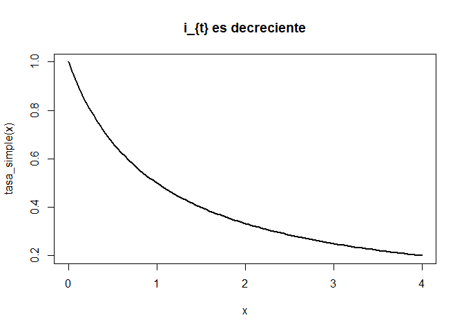

Matemáticas financieras
================

## La medida del interés.

\(\textbf{Definición 1}\) Definamos la función de acumulación \(a(t)\)
como el valor acumulado de un fondo al tiempo \(t\) con inversión
inicial de 1 (una unidad) al tiempo 0(\(a(0) = 1\)).

\(\textbf{Definición 2}\) La tasa de crecimiento del \(t\)-ésimo
año(Basado en la cantidad del fondo al inicio del año) está dada por:
\[i_{t} = \frac{a(t)-a(t-1)}{a(t-1)}\] \(i_{t}\) también se conoce como
la “tasa efectiva de interés”.

\(\textbf{Definición 3}\) Definimos la función monto \(A(t)\) como el
monto acumulado al tiempo \(t\) de una inversión de \(k\) unidades al
tiempo \(t = 0\). Esto es \(A(0) = k\).

\(\textbf{Obs 1}\) Es claro que \(A(t) = ka(t)\), así la tasa de
crecimiento de la función monto es:
\[i_{t} = \frac{a(t)-a(t-1)}{a(t-1)} = \frac{A(t)-A(t-1)}{A(t-1)}\]

\(\textbf{Obs 2}\) De lo anterior obtenemos:
\[A(t) = (1 + i_{t})A(t-1)\] Esto significa que el monto al final del
\(t\)-ésimo año es igual al monto al inicio del año (\(A(t-1)\)) más un
interés sobre \(A(t-1)\).

\(\textbf{Ejemplo 1}\) Dado \(A(t) = t^2 +100\) cálcula \(a(10)\)
\[A(0)= 100 = ka(0)= k\] \[A(10) = 200 = 100a(10)\] \[a(10) = 2\]

### Interés Simple.

Nos gustaría estudiar un caso particular de la función de acumulación,
nos gustaría que ver como se comporta \(a(t)\) si la ganancia acumulada
hasta al tiempo \(t\) es proporcional a \(t\), esto es:

\[a(t) - a(0) = it\] para alguna \[i \in \mathbb{R}\], esto equivale a:
\[a(t) = 1 + it\] Para toda \(t \in \mathbb{R}\).

\(\textbf{Obs 3}\) Tenemos lo siguiente:
\[i_{t} = \frac{a(t)-a(t-1)}{a(t-1)} = \frac{i}{1 + i(t-1) }\] Para todo
\(t > 1\), aquí observamos que \(a(t)\) es creciente pero \(i_{t}\) es
decreciente.

``` r
simple <- function(x){
  return(1 + 0.5*x)
}
tasa_simple <- function(x){
  return( 0.5 / (1 + 0.5*(x-1)) )
}
curve(simple ,-2,2,lwd = 2 ,main = "Función de acumulación con interés simple a(x) = 1 + 0.5x")
```

<!-- -->

``` r
curve(tasa_simple,0,4,lwd = 2 ,main = "i_{t} es decreciente")
```

<!-- -->

Por otro lado(sin suponer interés simple) Supongamos que tenemos tasas
efectivas \(i_{t}\) en el \(t\)-ésimo año para toda \(t \in \mathbb{N}\)
entonces usando la observación 2(que también es válida para \(a(t)\)) e
inducción obtenemos: \[a(t) = \prod_{j = 1}^t (1 + i_{j})\]

### Interés compuesto.

Del anterior producto si consideramos tasas efectivas de interés
constantes esto es \(i_{j} = i\) para toda \(j \in \mathbb{N}\),
entonces: \[a(t) = (1 + i)^t\] Este caso es llamado “Interés compuesto”

### Valor presente.

\(\textbf{Definición 4}\) El valor presente (\(VP\)) es el valor en el
tiempo cero de una inversión y el valor futuro (\(VF\)) es el valor de
una inversión n periodos después.

Si algún fondo es invertido a interés compuesto de una tasa \(i\) por
periodo, para n periodos, entonces:

\[VF = VP (1 + i)^n\] \[VP = \frac{VF}{(1+i)^n}\]

### Tasa Nominal de interés

\(\textbf{Definición 4}\) La tasa nominal anual de interés convertible
\(m\)-veces al año es igual a la tasa efectiva por periodo(de \(m\))
multiplicada por el número de periodos del año en este caso por \(m\).

\(\textbf{Ejemplo }\) Supongamos que tenemos un fondo que paga interés
cada trimestre(4 periodos por año) con tasa efectiva trimestral de
\(2\%\) (Ocupamos interés compuesto el cual la tasa efectiva trimestral
es constante, ¿Por qué?). La tasa nominal anual convertible
trimestralmente(4 veces al año) es \(8\% = 2\% * 4\).
